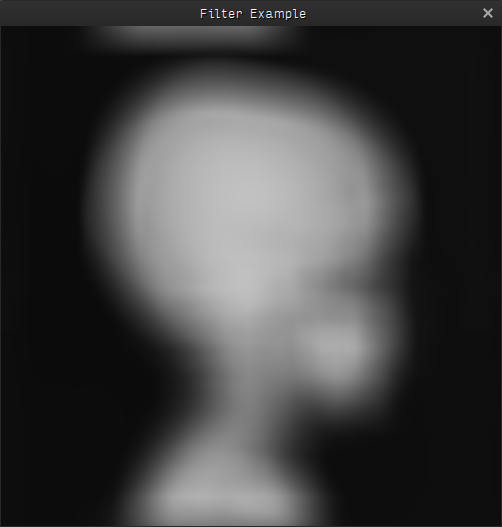

# Software Language Engineering
## winter term 2014/15 : assignment 02

I presented the __HIPAcc framework__ as an example for an __embedded domain specific language__ (DSL). The source coded defined in the DSL gets compiled by a source-to-source-compiler, to map functions defined in the DSL to OpenCL or CUDA API calls.

A simple image kernel example as an example for the [HIPAcc framework](http://www.hipacc-lang.org), which let you define image processing kernels in a __domain specific language__. The written code gets compiled into target specific GPGPU code ([CUDA](http://www.nvidia.de/object/cuda-parallel-computing-de.html) or [OpenCL](https://www.khronos.org/opencl/)).

The ```kernel()``` function of ```SimpleKernel``` implements a simple mean filter, which will blur the input image. The width of the kernel mask can be changed by changing ```filter_width```

## How-To

1. Download the [HIPAcc framework](http://www.hipacc-lang.org), build and install it ([github repo of HIPAcc](https://github.com/hipacc/hipacc)). Additional install instructions can be found on [hipacc-lang.org](http://www.hipacc-lang.org)
2. ```git clone https://github.com/GuidoSchmidt/hipacc-example.git```
3. ```cd hipacc-example```
4. ```make```
5. ```make run```





